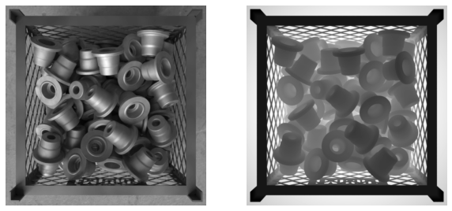
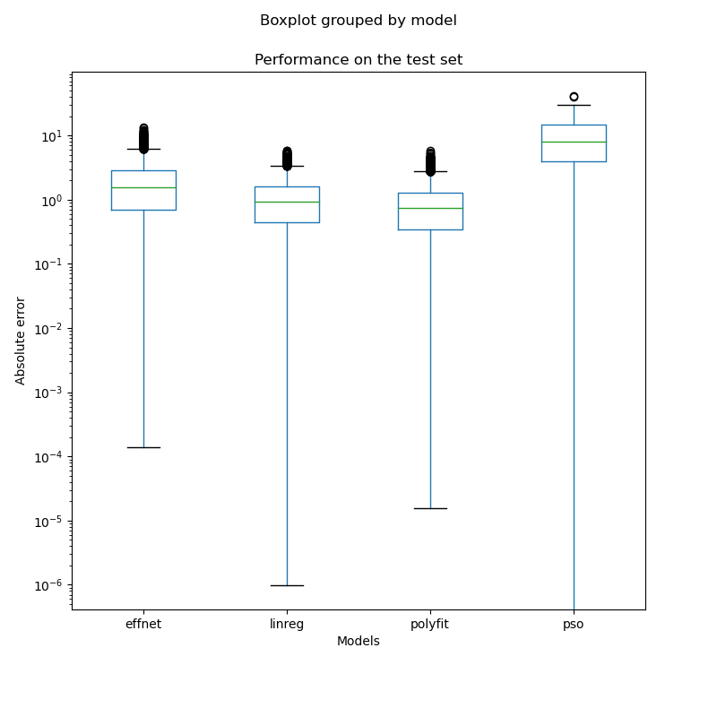
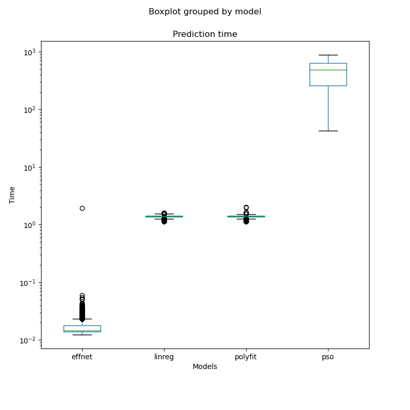

Counting parts in an RGBD image.
==============================



The goal is to try different approaches to properly estimate the amount of parts in a box using only an RGBD image taken from above. Two lines are approached to solve this problem: deep-learning based and "classic" computer vision techniques. As the challenge of the project arises in the occlusion of many parts in the box, it was framed as estimation/regression rather than object detection.

Data
------------

The images contain multiple (0-100) parts, all of the same geometry, in a steel box. We use synthetic data generated using Blender, simulating a perfect RGBD camera. The images were rendered upon physical simulations of the parts being dropped in the box. Small variations (e.g., lightining, box grid) were introduced. Only two channels were stored: grayscale and depth.

Deep-learning model
------------

We approach the task using EfficientNet's feature extractor followed by a fully-connected decoder. The model was implemented and trained using PyTorch and the experiments were tracked using weights and biases (see [transfer learning](https://wandb.ai/brunompac/part-counting-transfer-learning) and [fine-tuning](https://wandb.ai/brunompac/part-counting-fine-tuning) experiments). The model was implemented in `src.models.model.EffNetRegressor`. All training was done through `src.models.trainer.Trainer`, see `src/models/train_model.py` for example uses.

Computer Vision
------------

Without using any deep-learning to extract the features, we first extract the information of the parts inside the box. For this, we extract the mask of the inside of the box using Canny+Hough to get the lines of the border of the box (see src/). Then, the RGBD image is converted to point cloud, which is cropped based on the polygon defined by the mask. This results in a point cloud containing only the surface of the parts.

From the preprocessed point cloud, two approaches are experimented. First, an alignment approach is implemented to "dig" parts out of the image. The point cloud is converted to a voxel grid together with the model of the part. The part is then aligned to the voxelized surface using Particle-Swarm Optimization (other algorithms were tested, but PSO had the best results, even though it is very costly). The aligned part is the removed from the voxelized surface, effectively digging the voxel grid. This process is repeated until no more parts fit the voxel grid of the surface. This is implemented in `src.models.pso.dig_and_predict`.

As an alternative, naïve approach, the volume occupied is estimated from the voxelization of the surface. The number of parts is estimated from the volume using a linear regression and a polynomial curve fitted. See `src/models/regression.py`.

Example Use
------------

Useful interface functions are provided for all approaches for prediction. Example DL prediction:

```python
from src.features import preprocess_box_for_dl
from src.models import load_dl_model

img_fpath = 'path/to/img.png'

model = load_dl_model()

box = preprocess_box_for_dl(img_fpath)

n_parts = model(box)
```

Similar functions exist for the other approaches. See `src/models/base.py` and `src/features/base.py`. In `src/models/predict_model.py` is an example use of all of these functions.

Results
------------

None of the DL approach nor the one based on PSO was able to overcome the baseline methods. Still, the inference is much more efficient when done with the EfficientNet.

<p align="center">


</p>

Project Organization
------------

The development routine was to explore and experiment using the notebooks and consolidate the development in `src/`, through Python scripts.

    ├── LICENSE
    ├── Makefile           <- Makefile with commands like `make data`
    ├── README.md          <- The top-level README for developers using this project.
    ├── data
    │   ├── external       <- Data from third party sources.
    │   ├── interim        <- Intermediate data that has been transformed.
    │   ├── processed      <- The final, canonical data sets for modeling.
    │   └── raw            <- The original, immutable data dump.
    │
    ├── docs               <- A default Sphinx project; see sphinx-doc.org for details
    │
    ├── models             <- Trained models and model predictions
    │
    ├── notebooks          <- Jupyter notebooks used for exploration and tests
    │
    ├── reports            <- Generated analysis as HTML, PDF, LaTeX, etc.
    │   └── figures        <- Generated graphics and figures to be used in reporting
    │
    ├── requirements.txt   <- The requirements file for reproducing the analysis environment, e.g.
    │                         generated with `pip freeze > requirements.txt`
    │
    ├── setup.py           <- makes project pip installable (pip install -e .) so src can be imported
    │
    └── src                <- Source code for use in this project. Contains all
        │                     relevant code
        ├── __init__.py    <- Makes src a Python module
        │
        ├── data           <- Scripts to download or generate data
        │
        ├── features       <- Scripts to turn raw data into features for modeling
        │
        ├── models         <- Scripts to train models and then use trained models to make
        │                     predictions
        │
        └── visualization  <- Scripts to create exploratory and results oriented visualizations
            └── visualize.py


--------

<p><small>Project based on the <a target="_blank" href="https://drivendata.github.io/cookiecutter-data-science/">cookiecutter data science project template</a>. #cookiecutterdatascience</small></p>
